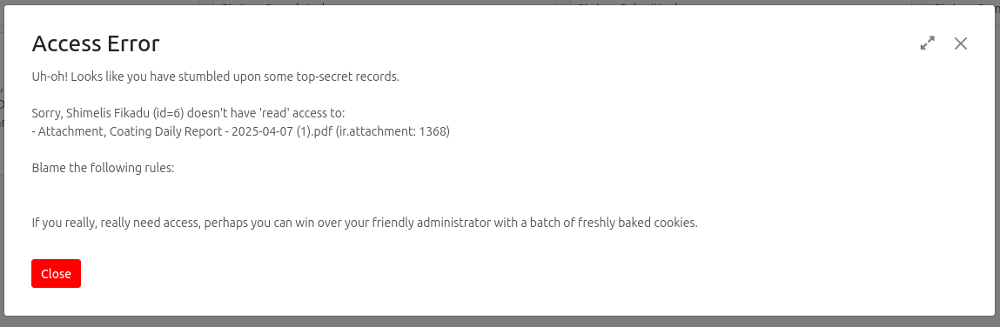

# Public Attachments Override for Odoo 18

## Overview

**Public Attachments Override** is an Odoo 18 module that automatically sets all attachments as public. This is useful for environments where unrestricted access to attachments is required, such as public portals or integrations.

## Features

- Overrides default Odoo behavior to make all new and updated attachments public.
- Ensures attachments are accessible without authentication.
- Simple, lightweight, and easy to install.

## Installation

1. Clone this repository into your Odoo `addons` directory:
    ```bash
    git clone https://github.com/chalaa/Odoo-Attachment-Public-Override.git
    ```
2. Restart your Odoo server.
3. Activate the developer mode in Odoo.
4. Go to **Apps**, update the app list, and install **Public Attachments Override**.

## Usage

Once installed, all attachments created or updated in Odoo will automatically be set as public. No further configuration is required.

## Technical Details

- Inherits the `ir.attachment` model.
- Overrides the `create` and `write` methods to set the `public` field to `True`.

## Compatibility

- Odoo 18 (tested)
- Depends on `base` and `mail` modules.

## Author & Maintainer

- **Author:** Chala Olani
- **Maintainer:** Chala Olani
- **Support:** [chalaolani@gmail.com](mailto:chalaolani@gmail.com)
- **Website:** [GitHub](https://github.com/chalaa/Odoo-Attachment-Public-Override)

## License

This module is licensed under the LGPL-3.0 License.

## Contributing

Pull requests and suggestions are welcome! Please open an issue or submit a PR.

## Screenshots



## Changelog